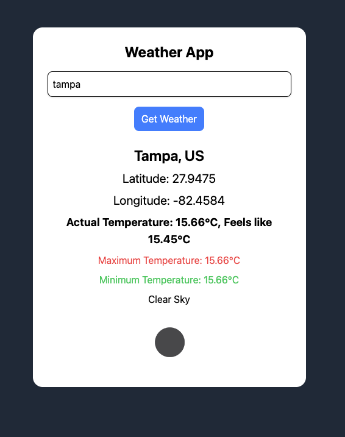

Weather app made with tailwind css and vanilla js. enter the city name and it will give you the latitude and longitude, temp, max and min temp, feels like temp and overall sky conditions. 

enter your own openweathermap api key to get the result. 

